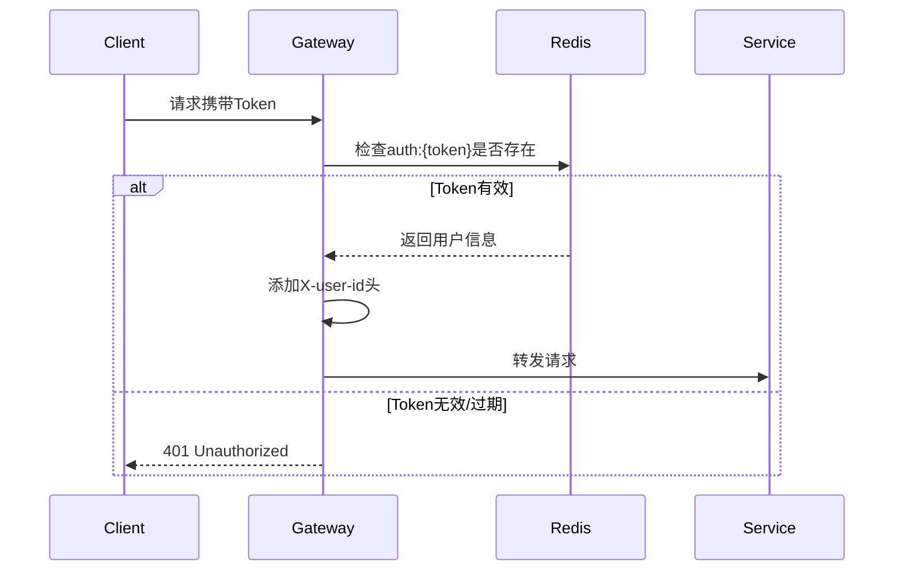

# Gateway Service 项目文档


## 项目概述

基于 Spring Cloud Gateway 构建的微服务网关服务，主要提供：

-   统一请求路由
-   JWT 身份认证
-   请求过滤与鉴权
-   跨域处理
-   响应标准化（通过`Result`类）

----------

## 核心功能

### 1. 请求过滤与认证

-   ​**白名单机制**：放行登录接口和 Swagger 文档相关路径
-   ​**JWT 验证**：
    -   验证 Authorization Header 中的 Token
    -   双重过期校验（Redis 存储 + JWT 自身有效期）
-   ​**用户信息传递**：通过请求头`X-user-id`传递认证用户ID

### 2. 路由管理

-   集成 9 个后端微服务
-   支持路径重写和前缀剥离
-   负载均衡（通过`lb://`协议）

### 3. 安全机制

-   Redis 存储 Token 信息（Key格式：`auth:token`）
-   Token 有效期管理（8小时系统级过期时间）
-   跨域安全配置（支持本地开发环境）

----------

## 技术栈

组件

用途

Spring Cloud Gateway

API 网关核心框架

Spring Data Redis

Token 存储管理

JJWT

JWT 生成与验证

Lombok

代码简化

Eureka Client

服务发现

----------

## 环境依赖

1.  ​**必需服务**：
    -   Redis Server (默认端口 6379)
    -   Eureka 注册中心 (默认端口 8761)
2.  ​**依赖微服务**：
    -   auth-service
    -   client-service
    -   usr-service
    -   portfolio-service
    -   等（详见路由配置）

----------

## 配置说明

### 关键配置项（application.yml）

yaml


```yaml
server:
  port: 8080
eureka:
  client:
    service-url: 
      defaultZone: http://localhost:8761/eureka
spring:
  data.redis:
    host: localhost
    port: 6379
  cloud.gateway:
    globalcors: # 跨域配置
      cors-configurations:
        '[/**]':
          allowed-origin-patterns: "http://localhost:[*]"
          allowed-methods: "*"
```

----------

## 安全认证机制

### 认证流程

mermaid




### JWT 配置

-   签名算法：HS512
-   Token有效期：24小时（JWT自身）
-   系统有效期：8小时（Redis存储控制）


----------

## 项目结构

```
src/main/java/com/csis/gatewayservice/
├── common
│   └── Result.java       # 统一响应格式
├── filter
│   └── AuthFilter.java   # 全局认证过滤器
├── utils
│   └── JwtUtils.java     # JWT 工具类
resources/
└── application.yml        # 配置文件
```